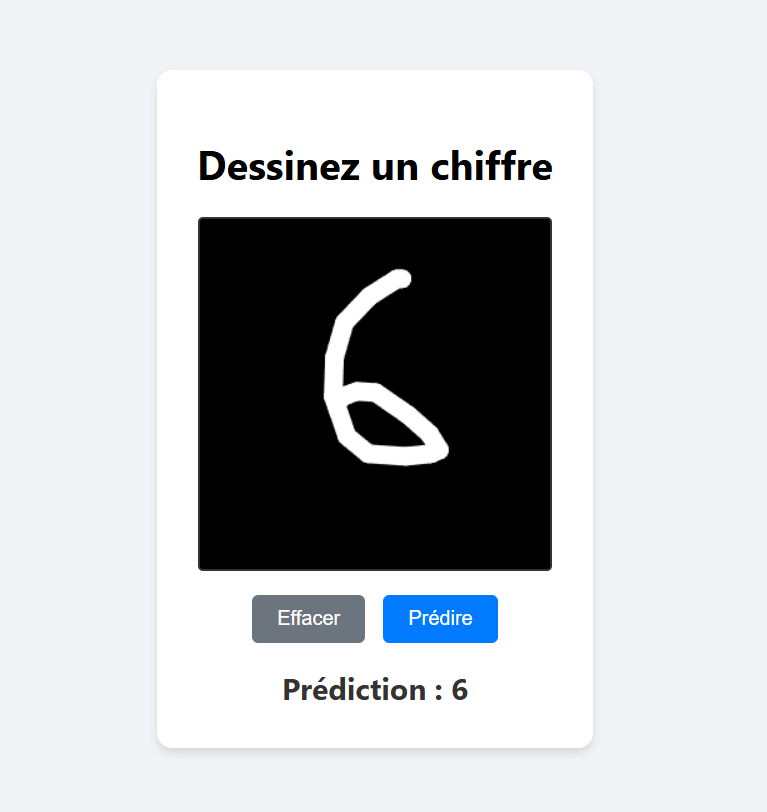
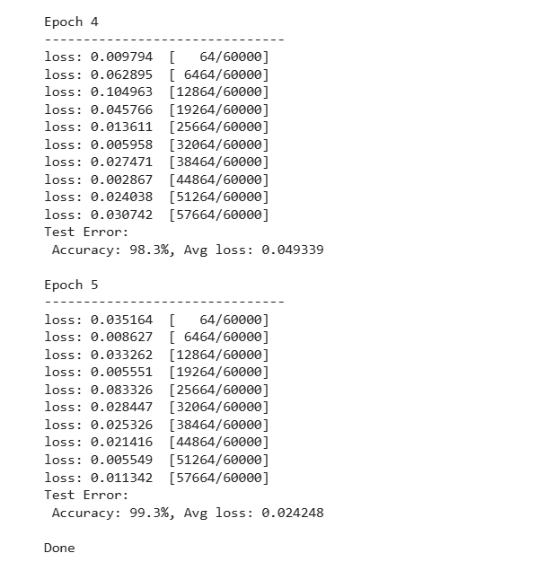

# DeepLearning
Modèle d’apprentissage et de reconnaissance d’images.
## UI 

## Lien du modèle
Le modèle est disponible sur [lien](https://colab.research.google.com/drive/1A6f6N9BH8GB7W6jt1LnlKq1zFAOjzzjz?usp=sharing)
### Entrainement 
```bash

#Entrainement 
epochs = 5
for t in range(epochs):
    print(f"Epoch {t+1}\n-------------------------------")
    train(training_dataloader, model, loss_fn, optimizer)
    test(test_dataloader, model, loss_fn)
print("Done")

```
#### Résultat final 



## Auteur
Dan Elenga